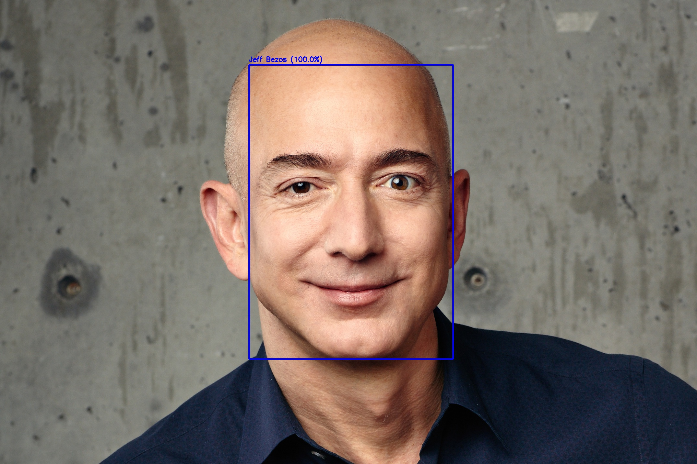
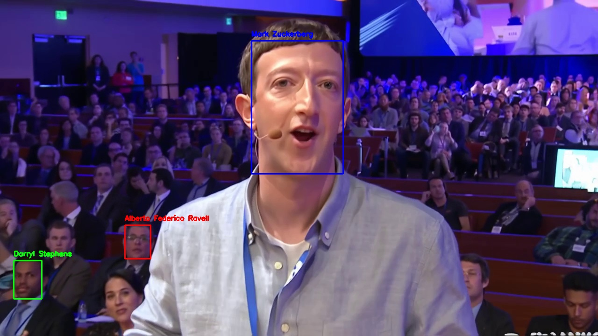

# Rekognition GenAI质检方案

基于 Amazon Rekognition 名人检测功能的AI生成多媒体内容质量控制综合解决方案。

## 🎯 场景描述

随着AI生成图片和视频的快速普及，内容合规性已成为企业和平台的关键关注点。AI模型可能会无意中生成包含真实名人的内容，从而导致法律和道德问题。

Amazon Rekognition 为AI生成的多媒体素材中的名人检测提供了优秀的解决方案，能够在发布或分发前实现自动化内容筛查和合规性验证。

## 🏗️ 架构概览

### 图片处理流程
```
本地图片 → Rekognition API → 检测结果 → OpenCV标注 → 输出图片
```

### 视频处理流程（异步）
```
S3视频 → start_celebrity_recognition → SNS通知 → SQS队列 → 轮询结果 → 提取关键帧
```

### 系统架构

该解决方案利用AWS托管服务实现可扩展的异步视频处理：

- **Amazon Rekognition**: 名人检测引擎
- **Amazon S3**: 视频存储和访问
- **Amazon SNS**: 异步作业通知  
- **Amazon SQS**: 作业状态消息队列
- **AWS IAM**: 服务权限和角色

## 🚀 快速开始

### 环境准备
```bash
pip3 install boto3 opencv-python
sudo yum install -y mesa-libGL  # Amazon Linux系统
```

### 设置AWS资源
```bash
python3 setup_resources.py
```
此脚本会自动创建所需的AWS资源，包括S3存储桶、SNS主题、SQS队列和IAM角色。

### 运行检测

**图片名人检测:**
```bash
python3 image_celebrity_detection.py
```

**视频名人检测:**
```bash
python3 test_video_celebrity.py
```

**提取视频关键帧并标注:**
```bash
python3 extract_frames_with_celebrities.py
```

## 📊 效果展示

### 图片检测结果

**原始图片:**


**检测结果: Jeff Bezos (100.0% 置信度)**


### 视频检测结果

**源视频:** 包含多个名人的S3视频

**检测到的名人:**
- Mark Zuckerberg (多个时间戳)
- Darryl Stephens
- Alberto Federico Ravell  
- Mali Harries
- Will Kimbrough
- Vir Sanghvi

**关键帧分析:**

*多名人检测，使用颜色编码边界框（红、绿、蓝分别代表不同个体）*

## 💡 核心实现

### 图片检测
```python
import boto3
import cv2

def detect_celebrities_in_image(image_path):
    with open(image_path, 'rb') as image_file:
        image_bytes = image_file.read()
    
    rekognition = boto3.client('rekognition')
    response = rekognition.recognize_celebrities(Image={'Bytes': image_bytes})
    
    # 处理和标注结果
    for celebrity in response['CelebrityFaces']:
        name = celebrity['Name']
        bbox = celebrity['Face']['BoundingBox']
        # 绘制边界框和标签
```

### 视频检测（异步）
```python
from rekognition_video import RekognitionVideo

def analyze_video():
    analyzer = RekognitionVideo(bucket, video, role_arn, sns_topic_arn, sqs_queue_url)
    
    # 启动异步分析
    analyzer.StartCelebrityDetection()
    
    # 通过SQS轮询等待完成
    if analyzer.GetSQSMessageSuccess():
        # 提取关键帧并标注
        extract_frames_with_boxes()
```

## 🔧 技术特性

- **异步处理**: 高效处理大型视频文件
- **多名人检测**: 识别每帧中的多个名人
- **颜色编码标注**: 为不同个体使用不同颜色
- **置信度评分**: 每个检测的可靠性指标
- **关键帧提取**: 自动选择代表性帧
- **可扩展架构**: 基于AWS托管服务构建

## 💰 成本优化

- **图片分析**: 每张图片 $0.001
- **视频分析**: 每分钟 $0.10
- **演示成本**: 总计不到 $0.01

## 🎯 应用场景

- **内容审核**: AI生成内容的自动化筛查
- **合规验证**: 确保生成内容符合法律要求  
- **品牌安全**: 防止未经授权的名人出现
- **媒体资产管理**: 多媒体内容的分类和标记
- **质量保证**: 部署前验证AI模型输出

## 📈 可扩展性与扩展

- 支持多文件批量处理
- 与内容管理系统集成
- 实时流媒体视频分析
- 自定义名人数据库集成
- 多语言标签支持

## 🛠️ 故障排除

**常见问题:**
- 确保AWS凭证配置正确
- 验证Rekognition、S3、SNS和SQS的IAM权限
- 安装OpenCV的系统依赖
- 检查S3存储桶访问权限

## 📄 许可证

本项目采用MIT许可证 - 详见LICENSE文件。

## 🤝 贡献

欢迎贡献！请随时提交Pull Request。
